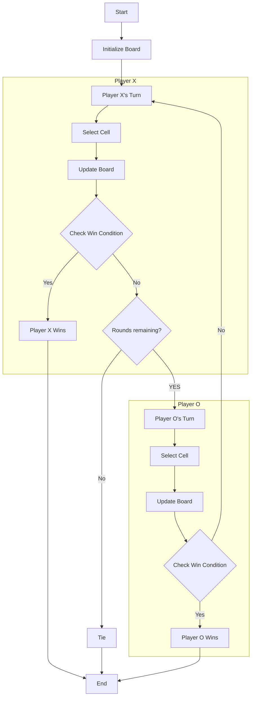

# Navigation durch Spielregeln

## Einführung

-   Programmcode lesen ist wie Spielregeln lesen
-   Strukturiertes und logisches Vorgehen

## Zeichenweise von links nach rechts, Zeilenweise von oben nach unten

-   Spielregeln: zeichenweise von links nach rechts, zeilenweise von oben nach unten
-   Programmcode: gleiche Lesereihenfolge

### Beispiel:

-   Spielregeln:
    ```
    1. Das Spiel wird auf einem 3x3 Raster gespielt.
    2. Zwei Spieler spielen abwechselnd.
    3. Ziel ist es, eine horizontale, vertikale oder diagonale Linie mit drei eigenen Zeichen zu bilden.
    ```
-   Programmcode:
    ```python
    board = [
        [' ', ' ', ' '],
        [' ', ' ', ' '],
        [' ', ' ', ' ']
    ]
    current_player = 'X'
    ```
-   Ablauf:

## Ausdrucksstarke Überschriften

-   Spielregeln: Überschriften für Struktur und Verständnis
-   Programmcode: Methodennamen beschreiben klar, was eine Methode tut

### Beispiel:
```python
def check_winner(board):
    # Überprüft, ob ein Spieler gewonnen hat
    pass

def make_move(player, position):
    # Führt einen Zug für den Spieler aus
    pass
``` 
## In Blöcken zusammengefasster Text

-   Spielregeln: Absätze/Blöcke erklären verschiedene Aspekte des Spiels
-   Programmcode: Konzepte in Methoden zusammengefasst

### Beispiel:
```python
def check_winner(board):
    # Horizontale Linien überprüfen
    for row in board:
        if row[0] == row[1] == row[2] != ' ':
            return row[0]

    # Vertikale Linien überprüfen
    for col in range(3):
        if board[0][col] == board[1][col] == board[2][col] != ' ':
            return board[0][col]

    # Diagonale Linien überprüfen
    if board[0][0] == board[1][1] == board[2][2] != ' ':
        return board[0][0]
    if board[0][2] == board[1][1] == board[2][0] != ' ':
        return board[0][2]

    return None
```
## Referenzen auf Textblöcke

-   Spielregeln: Verweis auf vorherige Absätze/Blöcke
-   Programmcode: Methodenaufrufe für Aktionen oder Ergebnisse

### Beispiel:
```python
def play_game():
    board = [
        [' ', ' ', ' '],
        [' ', ' ', ' '],
        [' ', ' ', ' ']
    ]
    current_player = 'X'

    while True:
        print_board(board)
        position = get_player_input(current_player)
        make_move(current_player, position, board)

        winner = check_winner(board)
        if winner:
            print(f"Spieler {winner} hat gewonnen!")
            break

        current_player = 'O' if current_player == 'X' else 'X'

play_game()
```


# Fazit

-   Programmieren ist ein strukturiertes und logisches Vorgehen
-   Methodennamen und -aufrufe sowie lesbare Blöcke sind entscheidend für Klarheit und Wartbarkeit eines Programms.